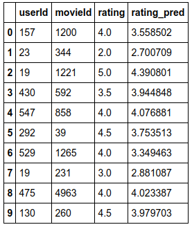

# Fastai 로컬에서 실행 시 graphviz 오류 해결법

안녕. Ryan 이다.  
  
최근 fastai 스터디에 참여하게 되어 fastbook을 이용하여 실습을 진행하고 있다.(https://github.com/fastai/fastbook)  
- fastai란, pytorch를 이용하여 보다 쉽게 딥러닝을 사용할 수 있도록 만든 라이브러리라고 생각하면 좋다.  

- 나는 jupyter notebook 환경을 선호하지 않기 때문에, .ipynb 보다 .py 환경에서 실습을 진행하고자 한다.  

그렇기에, 가장 기초적인 01_intro.ipynb 파일을 순차적으로 실행하고자 한다.  

- 필자는, ubuntu 18.04 + 2080ti + conda 환경 기반으로 진행하고 있다.  

우선, fastbook을 설치해야 한다.  
공식 fastbook repo에서는 아래와 같은 명령어로 설치를 권한다.  

```
pip install -Uqq fastbook 
```

하지만, conda 환경의 터미널에서는 해당 명령어로 설치할 수는 없고, conda forge로 설치도 되지 않았다.  

결국, 아래와 같은 명령어로 fastbook을 설치할 수 있었다.  

```
pip install fastbook
```

그 다음 예제로, resnet34 모델을 학습하고 간단히 fine tune을 하는 코드이다.  

```python
from fastai.vision.all import *
path = untar_data(URLs.PETS)/'images'

def is_cat(x): return x[0].isupper()
dls = ImageDataLoaders.from_name_func(
    path, get_image_files(path), valid_pct=0.2, seed=42,
    label_func=is_cat, item_tfms=Resize(224))

learn = cnn_learner(dls, resnet34, metrics=error_rate)
learn.fine_tune(1)
```
해당 코드를 처음 실행시, 아래와 같은 에러가 발생 했었다.
```
Missing `graphviz` - please run `conda install fastbook`
```
요구한 것처럼, conda install fastbook을 실행하였지만, 설치불가한 명령어였고  
anaconda에 들어가서 찾아보니 conda install -c forge fastai fastbook 명령어가 있었지만, 해당 문제가 해결되진 않았다.  
그래서, 여러 커뮤니티를 확인해본 결과, graphviz를 설치하면 됐고, 나는 아래 코드와 같이 설치했다.  
```
pip install graphviz
```
이렇게 설치하니 정상적으로 경고 문구 없이 실행됨을 확인했다.  
실행 결과는 아래와 같았다.  
```
epoch     train_loss  valid_loss  error_rate  time    
0         0.171910    0.015055    0.006089    00:13     
epoch     train_loss  valid_loss  error_rate  time    
0         0.073512    0.024202    0.006089    00:18  
```

그 다음, 고양이 classification 하는 예제이다.  
```python
from fastai.vision.all import *
path = untar_data(URLs.PETS)/'images'

def is_cat(x): return x[0].isupper()
dls = ImageDataLoaders.from_name_func(
    path, get_image_files(path), valid_pct=0.2, seed=42,
    label_func=is_cat, item_tfms=Resize(224))

learn = cnn_learner(dls, resnet34, metrics=error_rate)
learn.fine_tune(1)

uploader = SimpleNamespace(data = ['images/chapter1_cat_example.jpg'])
img = PILImage.create(uploader.data[0])
is_cat, _, probs = learn.predict(img)
print(f"Is this a cat?: {is_cat}.")
print(f"Probability it's a cat: {probs[1].item():.6f}")
```
코드 실행 결과는 아래와 같다.  
```
epoch     train_loss  valid_loss  error_rate  time    
0         0.171910    0.015055    0.006089    00:13     
epoch     train_loss  valid_loss  error_rate  time    
0         0.073512    0.024202    0.006089    00:18     
Is this a cat?: True.
Probability it's a cat: 1.000000
```
그 다음 예제로는, unet을 이용하여 모델 학습 후, 결과를 출력하는 예제이다.
```python
from fastai.vision.all import *
from matplotlib import pyplot as plt

path = untar_data(URLs.CAMVID_TINY)
dls = SegmentationDataLoaders.from_label_func(
    path, bs=8, fnames = get_image_files(path/"images"),
    label_func = lambda o: path/'labels'/f'{o.stem}_P{o.suffix}',
    codes = np.loadtxt(path/'codes.txt', dtype=str)
)

learn = unet_learner(dls, resnet34)
learn.fine_tune(8)
learn.show_results(max_n=6, figsize=(7,8))
plt.show()
```
출력 결과는 아래와 같다.  
```
epoch     train_loss  valid_loss  time    
0         3.184689    2.640854    00:02     
epoch     train_loss  valid_loss  time    
0         1.841547    1.496456    00:01     
1         1.574562    1.144143    00:00     
2         1.393180    1.013539    00:00     
3         1.268474    0.911934    00:00     
4         1.135931    0.829669    00:00     
5         1.024113    0.806082    00:00     
6         0.932694    0.800743    00:00     
7         0.862138    0.798791    00:00
```
<div align=center>


</div>

그 다음, LSTM 예제이다.  
간단하게 textdata를 loader한 후, lstm 모델로 학습하는 코드이며 아래와 같다.
```python
from fastai.text.all import *

dls = TextDataLoaders.from_folder(untar_data(URLs.IMDB), valid='test')
learn = text_classifier_learner(dls, AWD_LSTM, drop_mult=0.5, metrics=accuracy)
learn.fine_tune(4, 1e-2)
```
해당 코드를 실행시키면 대부분의 사용자들은 OOM(Out Of Memeory) 현상이 발생될 것이다.  
아마 기본 batch size가 꽤 높은 것 같다.  
이에 따라, 아래와 같이 간단히 batch size를 수정할 수 있다.  

```python
from fastai.text.all import *

dls = TextDataLoaders.from_folder(untar_data(URLs.IMDB), valid='test', bs=32)
learn = text_classifier_learner(dls, AWD_LSTM, drop_mult=0.5, metrics=accuracy)
learn.fine_tune(4, 1e-2)
```
batch size를 32로 변경 시 OOM 현상 없이 정상적으로 학습이 된 것을 확인할 수 있었으며, 결과는 아래와 같다.  
```
epoch     train_loss  valid_loss  accuracy  time    
0         0.599393    0.398942    0.816320  01:57     
epoch     train_loss  valid_loss  accuracy  time    
0         0.294518    0.255895    0.899960  03:42     
1         0.227331    0.210735    0.918440  03:25     
2         0.179019    0.193152    0.926960  03:30     
3         0.155008    0.195803    0.928000  03:28     
```
학습된 모델로 아래와 같은 문장이 긍정적인 문장인지, 부정적인 문장인지 분류해주는 모델을 학습 시켰다. 아래의 코드를 추가하면 긍정이면 pos를, 부정이면 neg를 출력한다.  

```python
from fastai.text.all import *

dls = TextDataLoaders.from_folder(untar_data(URLs.IMDB), valid='test', bs=32)
learn = text_classifier_learner(dls, AWD_LSTM, drop_mult=0.5, metrics=accuracy)
learn.fine_tune(4, 1e-2)
print(learn.predict("I really liked that movie!"))
```
코드 실행결과는 아래와 같다.
```
epoch     train_loss  valid_loss  accuracy  time    
0         0.617412    0.398000    0.820280  01:58     
epoch     train_loss  valid_loss  accuracy  time    
0         0.315493    0.346211    0.836240  03:45     
1         0.226108    0.225298    0.912760  03:45     
2         0.186827    0.191734    0.925800  03:35     
3         0.166055    0.191913    0.928440  03:33     
('pos', tensor(1), tensor([6.1875e-04, 9.9938e-01]))
```
다음은, tabular dataset을 이용한 학습 방법이다.  
tabulr는 표로 정리된 데이터들을 의미하는 것 같다.  
학습에 사용된 코드는 아래와 같다.  
```python
from fastai.tabular.all import *
path = untar_data(URLs.ADULT_SAMPLE)

dls = TabularDataLoaders.from_csv(path/'adult.csv', path=path, y_names="salary",
    cat_names = ['workclass', 'education', 'marital-status', 'occupation',
                 'relationship', 'race'],
    cont_names = ['age', 'fnlwgt', 'education-num'],
    procs = [Categorify, FillMissing, Normalize])

learn = tabular_learner(dls, metrics=accuracy)
learn.fit_one_cycle(3)
```
실행 결과는 아래와 같다.  

```
epoch     train_loss  valid_loss  accuracy  time    
0         0.371174    0.357027    0.830160  00:03     
1         0.359988    0.347705    0.839988  00:03     
2         0.344455    0.344762    0.838759  00:03  
```

그 다음, collab 데이터셋을 이용한 모델 학습이다.  
해당 데이터는 추천 시스템에서 사용되는 Machine Learning 모델을 만드는 내용 인 것 같다.  
그 사람이 해당 영화를 얼만큼 rating 할 지 예측하는 모델을 학습한다.  
학습 코드는 아래와 같다.  

```python
from fastai.collab import *

path = untar_data(URLs.ML_SAMPLE)
dls = CollabDataLoaders.from_csv(path/'ratings.csv')
learn = collab_learner(dls, y_range=(0.5,5.5))
learn.fine_tune(10)
learn.show_results()
```
필자의 경우, 왜인지는 모르겠으나 해당 코드를 실행 시 untar_data 함수를 호출하지 못한다고 에러가 발생했다. (pycharm 환경)  
그래서, 임시 방편으로 위에서 import 했던 tabular 코드를 추가했더니 정상(?) 실행 되었다.  
해당 코드의 결과는 html 파일로 제공되기 때문에 pycharm 에서는 확인할 수 없었고, 원문의 결과로 대체한다.  

<div align=center>



</div>

이로써, 1장에 있는 모든 코드를 실행하고 결과를 확인해봤다.  
앞으로도 2, 3장 등 지속적으로 실행할 수 있는 코드들을 확인하고 분석해보고자 한다.  